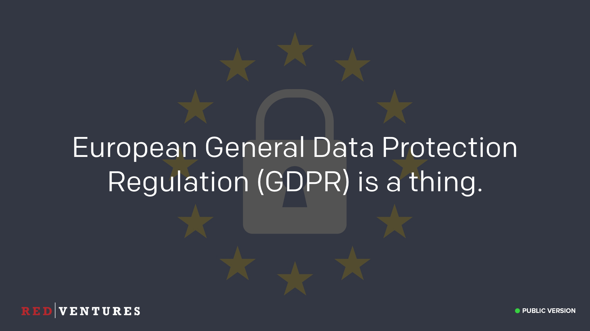
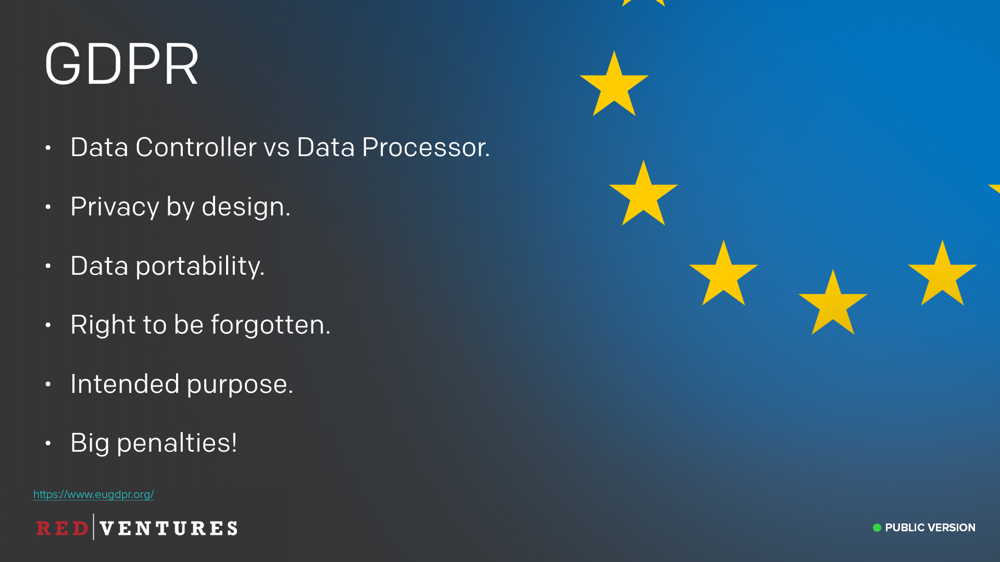
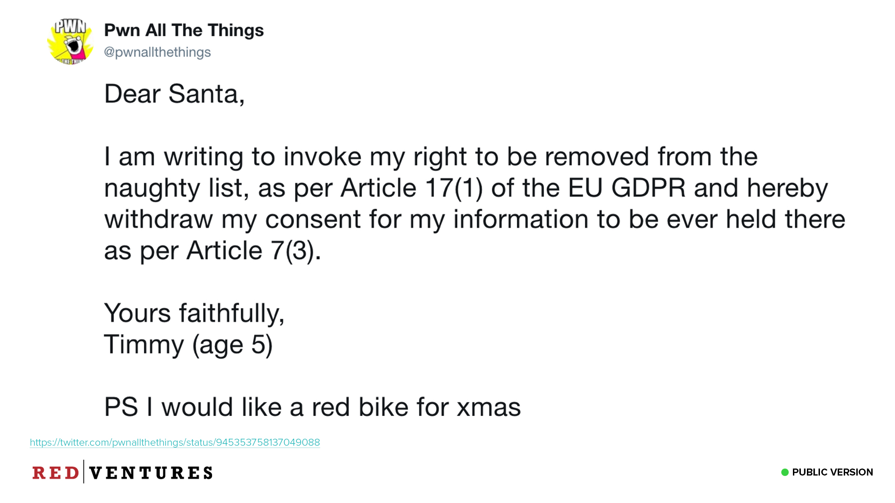

### Compliance

_<input type="checkbox" id="129" /><label for="129"></label>_
_128. Compliance._

OK, we're on to our final topic. Compliance.

> If you don't know what that background image is about, go and watch a cheesy 80's sci-fi movie called "[Flight of the Navigator](https://www.imdb.com/title/tt0091059/)".

We have a variety of compliance restrictions that affect how we operate, so I want to spend a bit of time talking about each of them.

---

### GDPR

<input type="checkbox" id="130" /><label for="130"></label>
_129. GDPR._

The first one is GDPR. This stands for General Data Protection Regulation and is a new European law coming into effect later this year. I'm required to tell you that this exists, and is a thing.

...

Just kidding, of course I'm going to go into more detail.

---

### GDPR

<input type="checkbox" id="131" /><label for="131"></label>
_130. GDPR. [Reference](https://www.eugdpr.org/)_

GDPR goes into effect on 25th May 2018, and has very strict rules for how personal information should be handled, with big fines for those who don't follow the rules. We will be subject to GDPR, as we handle data for users who are EU citizens.

We are mostly considered a "Data Processor" under GDPR, rather than a Data Controller. Our customers are the data controller (they control the data of their employees), and we process their data on their behalf. Any customers who are subject to GDPR as controllers will need to execute a Data Processing Agreement (DPA) with us if we are to continue processing their data. Since we also have third-parties which process customer data on _our_ behalf (for example, our notification and telephony providers), we will also need to execute DPA's with them. It's worth noting that there are also a few cases where we would be considered a Data Controller, such as for our UK based employees.

We'll need to include extra steps in our development processes to include data protection from the onset of the designing our systems, rather than something that's added on later.

Data portability is the right for a data subject (i.e. our users) to receive the personal data we have stored which concerns them. We need to provide this in a "commonly used and machine readable format". The user also has the right to transmit that data to another controller.

Another thing GDPR requires is the "Right to be Forgotten", also known as Data Erasure, this entitles the data subject to have the data controller erase his/her personal data, cease further dissemination of the data, and potentially have third parties halt processing of the data.

One very important part is that we have to specify the intended purpose of all personal data we will process, and cannot use that data for any other purpose. For example, if we specify the intended purpose of collecting email addresses is to send Red Ventures notifications, we cannot then use that email address to send the user marketing material.

And there are very hefty penalties for any breach of GDPR. 4% of annual global turnover, or €20 Million, whichever is greater.

There are more things involved with GDPR that I’ve gone over here, such as “Consent” and “Profiling”, etc. The link at the bottom has more information if you’re interested.

---

### Dear Santa

<input type="checkbox" id="132" /><label for="132"></label>
_131. Dear Santa... [Reference](https://twitter.com/pwnallthethings/status/945353758137049088)_

The bottom line is that GDPR is going to lead to a lot of interesting situations in the industry.

---

### PCI

<input type="checkbox" id="133" /><label for="133"></label>
_132. Redacted slides._

The Payment Card Industry Data Security Standard (PCI DSS) is a set of standards that all companies that accept, process, store or transmit credit card information must follow. Failure to maintain a secure environment can threaten our ability to handle this data, which would alleviate the need for most of us to show up to work tomorrow.

---

### PCI Compliance

<input type="checkbox" id="133" /><label for="133"></label>
_133. Redacted slides._

Many of the security practices we've discussed are part of PCI compliance, including having restricted access when you come in to our facilities. We also restrict access to all computers and the digital resources on our networks. For most of us, simply following the normal practices at RV ensures that we will be compliant. In fact, this training is part of our compliance program, so thanks for being here so we can all have jobs in the future.

---

### HIPAA

<input type="checkbox" id="133" /><label for="133"></label>
_134. Redacted slides._

HIPAA
HIPAA, or the Health Insurance Portability and Accountability Act, mandates the privacy and security of certain health-related information. There are two main rules associated with the act; the privacy rule and the security rule. Basically, the privacy rule outlines what information needs to be protected and the security rule addresses the technical safeguards that must be put in place.

---

### PHI

<input type="checkbox" id="133" /><label for="133"></label>
_135. Redacted slides._

Protected health information is any “Individually identifiable health information.” This is any data that relates to:

    * the individual’s past, present or future physical or mental health or condition,

    * the provision of health care to the individual, or

    * the past, present, or future payment for the provision of health care to the individual,

Examples include many common identifiers (e.g., name, address, birth date, Social Security Number).

---

### Health info at RV?

<input type="checkbox" id="133" /><label for="133"></label>
_136. Redacted slides._

Why do we fall under the governance of HIPAA? Well, honestly, many of our businesses don't. But anyone working with our health care partners needs to be aware of these restrictions and will have to go through more extensive training. But we should all understand that HIPAA, like GDPR, is a thing at RV and it may impact the access we have to certain data.