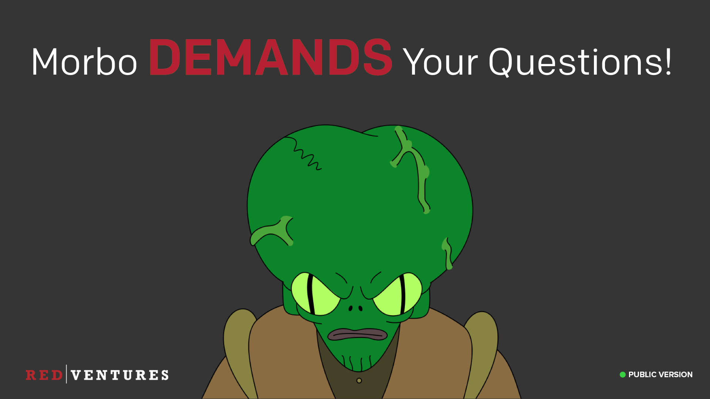

### Would you like to know more?

_<input type="checkbox" id="136" /><label for="136"></label>_
_136. Would you like to know more?_

And that's it! All of the topics I had. I hope you all learned something useful, and if not, I hope you at least had a laugh at some of the jokes. If you want to know more about any of the material here, or anything security related that I didn't get chance to cover, here are some ways you can find out more.

---

### Contact Security Team

<input type="checkbox" id="137" /><label for="137"></label>
_137-139. Redacted slides._

Redacted
> These slides gave an overview of how folks can reach the security team, and links to our internal wiki pages, Slack rooms, and details on when we run office hours.

---

### Llama

<input type="checkbox" id="140" /><label for="140"></label>
_140. Llama._

And for all of you waiting for the animal to go with the colour from the start, it's Llama. So you'll be getting a feedback survey in a few moments, just enter the colour from the start, and this animal, and that will "prove" that you attended the security training for this year.

You'll also have a chance to provide feedback on the training, which will shape how we change it next year. I will assume any negative feedback about my jokes are all in jest.

---

### Questions?

<input type="checkbox" id="141" /><label for="141"></label>
_141. Questions?_

So with that, I'll open it up to questions. Thanks very much!

> If you have questions about this training material, feel free to ask me on Twitter, I'm [@r_adams](https://twitter.com/r_adams).

---

### Image Credits

<input type="checkbox" id="142" /><label for="142"></label>
_142. Image credits._

> Here are the credits for all the images used throughout this training material.

---

*[SRE]: Site Reliability Engineering
*[NDA]: Non-Disclosure Agreement
*[ISP]: Internet Service Provider