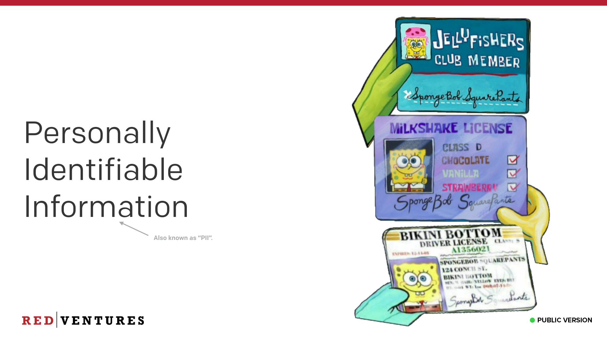
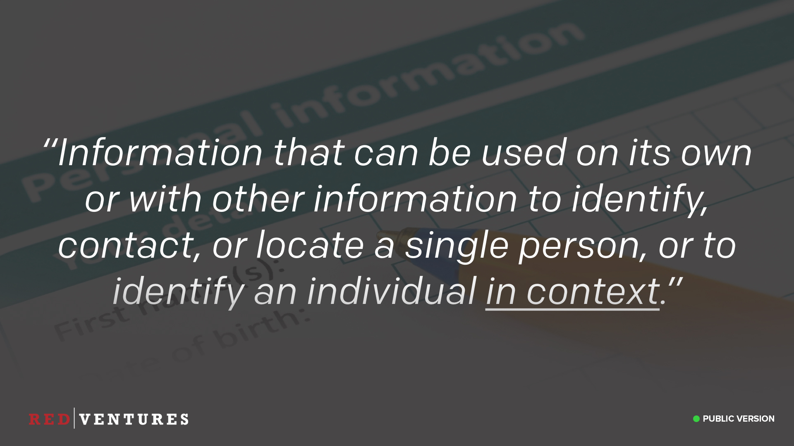
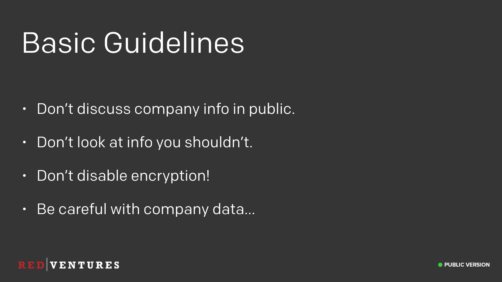
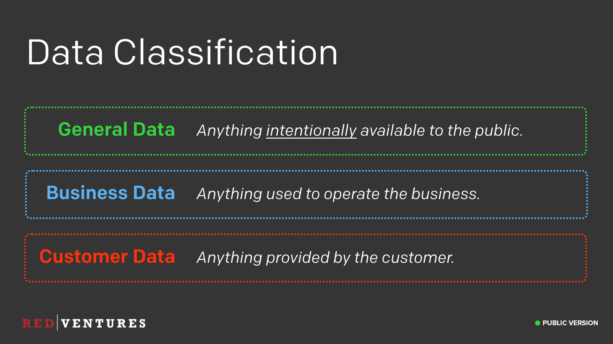
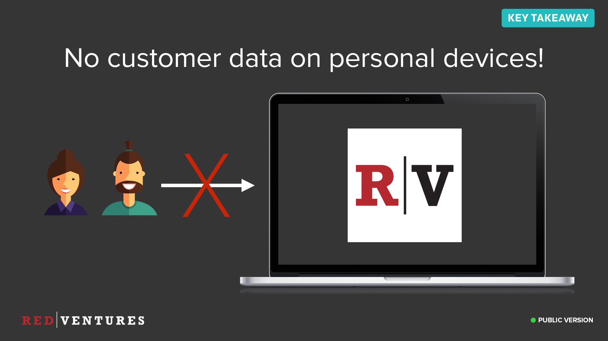

### Personally Identifiable Information (PII)

_<input type="checkbox" id="119" /><label for="119"></label>_
_119. Personally Identifiable Information (PII)._

The next topic is Personally Identifiable Information, usually abbreviated to PII, or sometimes just PI.

---

### What is PII?

<input type="checkbox" id="120" /><label for="120"></label>
_120. What is PII?_

This is any information that can be used to identify a single person in context. By that I mean, it's no good just to be able to tell that certain data belongs to a single human, you have to be able to identify that particular human out of all the others that exist.

---

### Basic Guidelines

<input type="checkbox" id="121" /><label for="121"></label>
_121. Basic Guidelines._

We have some basic guidelines when it comes to personal information at Red Ventures. First of all, don't discuss company information in public. The number of times I overhear conversations out in the world from folks at other companies discussing things they really shouldn't be is astounding. Please don't do the same.

Don't look at information you shouldn't. Let's say you come across a list of employees and their SSN's. That's pretty bad, and is something we want to know about. Don't just scroll through the data and keep it to yourself. Let us know immediately so we can do something about it. Just like with stolen devices, you won't get into trouble for accessing something you shouldn't have access to if it was an honest mistake. But if you look at that information and don't tell anyone, then later we find out you accessed it, that's going to cause problems.

All company devices are encrypted by default when you get them. Don't turn this off. We give you administrative access to your laptops because we want you to have the ability to do whatever you need with them to get your job done. Turning off encryption is not one of them.

Finally, we need to be careful with company data. What is company data you might ask.

---

### Company Data?

<input type="checkbox" id="122" /><label for="122"></label>
_122. Company Data?_

It's not this type of data. It's the data we store in our systems that allow us to run our business.

---

### Data Classification

<input type="checkbox" id="123" /><label for="123"></label>
_123. Data classification._

We have three distinct types of data at Red Ventures.

* *General Data* is anything that is _intentionally_ available to the public. The key being intentionally. If something gets leaked, it doesn't automatically become general data.
* *Business data* is anything used to operate our business. Examples would be our employee list, payroll information, etc.
* *Customer data* is any data provided to us by the customer.

Customer data is by far the most valuable and protected data we have at Red Ventures, and is subject to our most stringent security rules.

---

### Data Handling

<input type="checkbox" id="124" /><label for="124"></label>
_124. Data handling._

How we handle data depends on what type of data it is. For example, general data does not need to be encrypted, as it's considered public. All other types of data should always be encrypted in transit and at rest however.

You can view a more detailed description of our data handling policies in our written policies. To request a copy of this, please contact our security team.

---

### Personal Devices

<input type="checkbox" id="126" /><label for="126"></label>
_125. No Red Ventures data on personal devices._

When it comes to handling data, it's important to make sure that certain data never leaves our secured environments.

We do not allow any Red Ventures data to be stored on your personal devices. This means you do not clone a Red Ventures git repository to your personal device, and you do not download sales contracts or employee lists to your personal devices.

This does not mean you can't check your email from your phone. Any website or hosted platform is perfectly fine to access from your personal devices. You should never be downloading and storing anything on your phone that is Red Ventures related however.

If you're unsure what counts as a hosted platform, just ask us!

This is also why it's important for you to let us know if your personal device is lost or stolen, so we can lock it out from all of our services.

---

### Red Ventures Devices

<input type="checkbox" id="127" /><label for="127"></label>
_125. No customer data on Red Ventures devices._

Likewise, you should never store customer data, even on Red Ventures devices! Customer data is never to leave our production environment under any circumstances.

That means you do not download parts of our production database to your Red Ventures laptops, you do not transfer real production data to our staging or sandbox environments to run some tests, etc. Our production environment has strict security controls and audit logging in place. If you transfer data away from those environments, we lose those abilities.

We have analytics mechanisms available to you in our production environment to run these types of things. If you need something different or special set up for a specific project, please let us know and we're more than happy to guide and help you set that up.

---

### Be Mindful

<input type="checkbox" id="128" /><label for="128"></label>
_128. Be Mindful._

The takeaway from all of this is that you should be mindful of how you handle data. Treat customer data as you would want your own data to be treated. Like I said earlier, customer data is our most valuable asset, and customers are trusting us with it. Breaching that trust is unacceptable, and so we all need to make sure we follow the rules.

If you’re not sure how to treat certain data, just ask us! Maybe it’s a case we hadn’t considered yet, and something we need to create a policy for.

---