### Passwords

_<input type="checkbox" id="047" /><label for="047">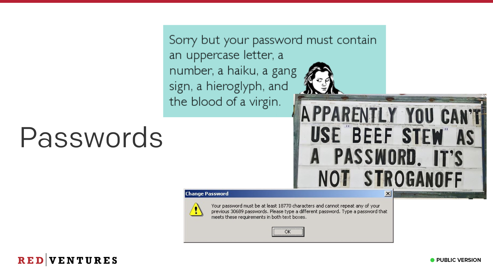</label>_
_047. Passwords._

It's time for our next topic, everyone's favorite, Passwords.

---

### What are passwords?

<input type="checkbox" id="048" /><label for="048">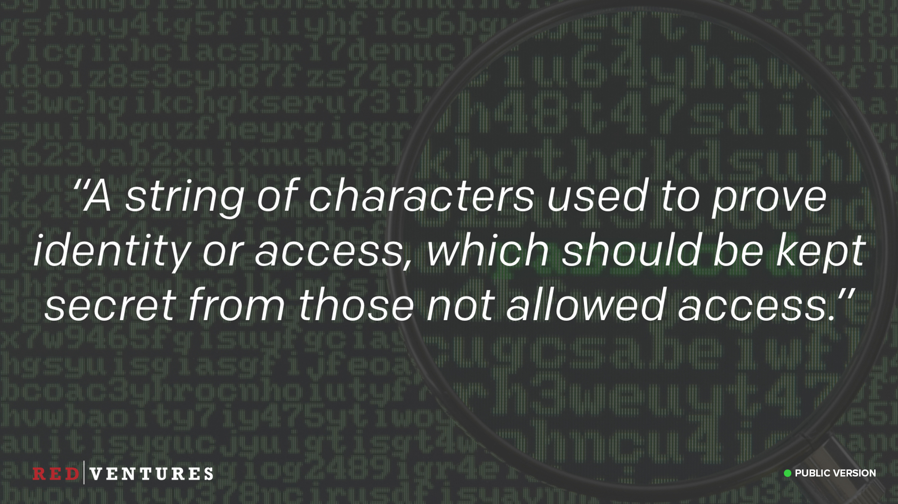</label>
_048. What are passwords?_

Hopefully you all know what a password is, but just in case you don't, here's a quick definition. Basically they're those things you have to type in all the time in order to do anything on a computer.

---

### T3h 1337 Haxx0rs!!!111one!

<input type="checkbox" id="049" /><label for="049"></label>
_049. T3h 1337 Haxx0rs!!!111one!_

Rather than just give you a list of rules for how to pick good passwords, I want to try something a bit different here. I'm going to teach you all how to be hackers, just like in the movies. I'm going to teach you how to crack passwords. Don't worry, I see some wide eyes in the audience, I'm going to keep this as non-technical as I can.

I do need to talk about one technical concept first though...

---

### Hashing

<input type="checkbox" id="050" /><label for="050"></label>
_050. Hashing. [Reference](https://en.wikipedia.org/wiki/Cryptographic_hash_function)_

...and that's something called "Hashing".

---

### ~~Hashing~~

<input type="checkbox" id="051" /><label for="051">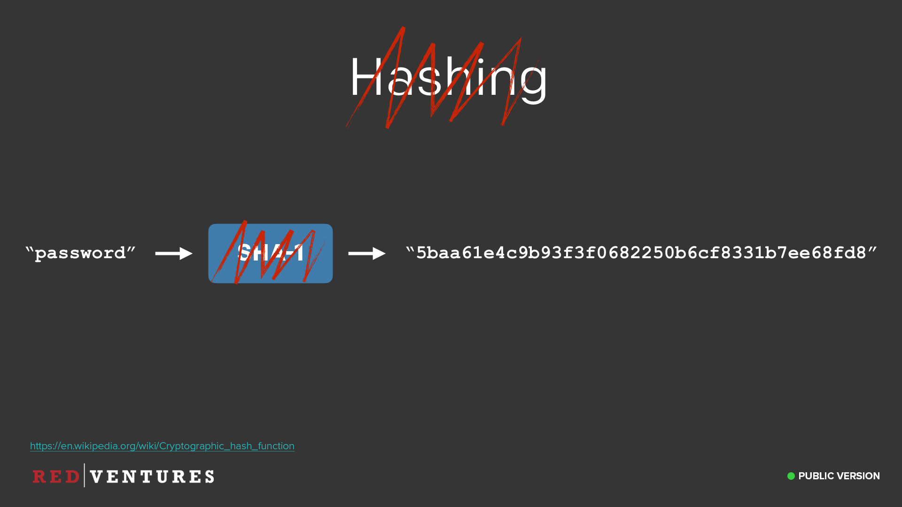</label>
_051. ~~Hashing~~. [Reference](https://en.wikipedia.org/wiki/Cryptographic_hash_function)_

Actually, you don't need to know the name.

---

### Magic

<input type="checkbox" id="052" /><label for="052"></label>
_052. Magic._

For the purpose of this discussion, it's "Magic". What this magic does is take a password, does "stuff" to it, and gives you a magic string of characters at the end.

This magic process has two important features that we care about.

---

### Repeatable

<input type="checkbox" id="053" /><label for="053"></label>
_053. Repeatable._

The first is that it's repeatable. If you give it the same password, it will always give you the same magic string. Always.

---

### Irreversible

<input type="checkbox" id="054" /><label for="054"></label>
_054. Irreversible._

The second is that it's irreversible. If you only have the magic string, there's no amount of fancy mathematics or algorithms that can get you back to the password.

The only way you'd know that a password correlates to that magic string is if you had some sort of table that stored both passwords and magic strings together and you could see them together.

---

### Create Account

<input type="checkbox" id="055" /><label for="055">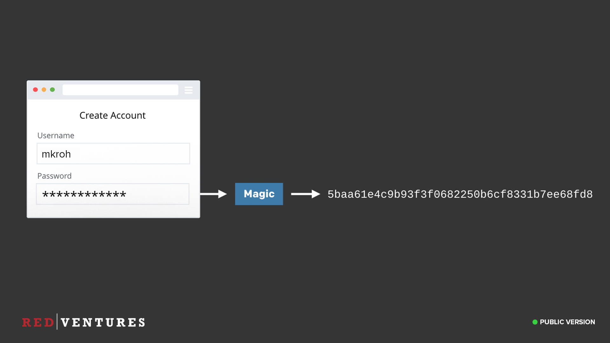</label>
_055. Creating an account._

So why am I telling you this? Well, it may surprise you to know that websites don't actually store your password (at least, they shouldn't). When you create an account on a website, they do this "magic" to your password, and store the result in their database instead of your password.

Why do they do this? Well, there's always at least one employee who can see the values stored in the database. If they were to store the real passwords, anyone with access to the database could have them, and not everyone is honest. Well, everyone here is but it's still bad practice.

---

### Login

<input type="checkbox" id="056" /><label for="056"></label>
_056. Logging in to an account._

But if they've only stored the magic string, how do you login to websites? Well, when you enter your password, they do the same process again that created the hash in the first place. They perform the magic on whatever you enter, and get the result.

---

### Matches?

<input type="checkbox" id="057" /><label for="057">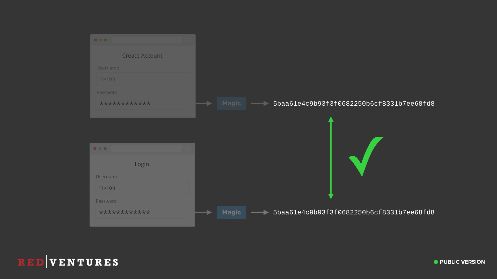</label>
_057. Did you enter the same thing?_

If the result matches what's in the database, then they know it's you and the login succeeds.

Websites don't really care about your password. They only care that you entered the same thing you did when you registered. So there's no need to store your actual password, they can just store a representation of it, safe in the knowledge that no one can reverse it back to a password.

Except that's what we're going to do now...

---

### Evil Corp

<input type="checkbox" id="058" /><label for="058"></label>
_058. EvilCorp customer database._

Last night I went ahead and stole a customer database. Doesn't matter where I got it from. For all you know this could be the Verizon customer database, after all I'm an engineer who has access to that, aren't I? (It's not, but if that scared you for a moment, then you should familiarize yourself with our access control policies).

This stolen database contains usernames, password hashes (that's the magic string), and a password hint. Some of you may be thinking that the password hint is cheating here. Websites don't store password hints, right? Well, some do. But you're right, most don't. So you can think of them as "Answers to Security Questions" if it makes you feel better (I'll talk more about security questions later).

We're now going to get the passwords for all of these users.

---

### pumpkin22

<input type="checkbox" id="059" /><label for="059"></label>
_059. pumpkin22._

The first thing you might notice, is that sometimes the username itself can give things away. Let's take a look at this user first. "pumpkin22", and their password hint is "fav holiday". Hmmm... pumpkins, holiday. I think I have a pretty good idea of what their password is.

But remember when I told you about the two important properties of the "magic", the first was that given the same password, you always get the same magic string. So we actually have more information to help us here.

---

### arup

<input type="checkbox" id="060" /><label for="060"></label>
_060. arup._

We can see that this user "arup" has exactly the same password as "pumpkin22".

> This isn't always the case, there's something called "Hash Collision" which can occur. But I'm ignoring that here in order to keep things simple.

So now we can use "arup"'s password hint as an extra bit of information. So, "pumpkin", "holiday", "scary movie". Hopefully, by now you've guessed that this password is `halloween`.

---

### halloween

<input type="checkbox" id="061" /><label for="061"></label>
_061. halloween._

So there we are, we just broke a 9-character password in less than a minute, without writing any code. Pretty cool, right?

Let's try another one.

---

### rich

<input type="checkbox" id="062" /><label for="062">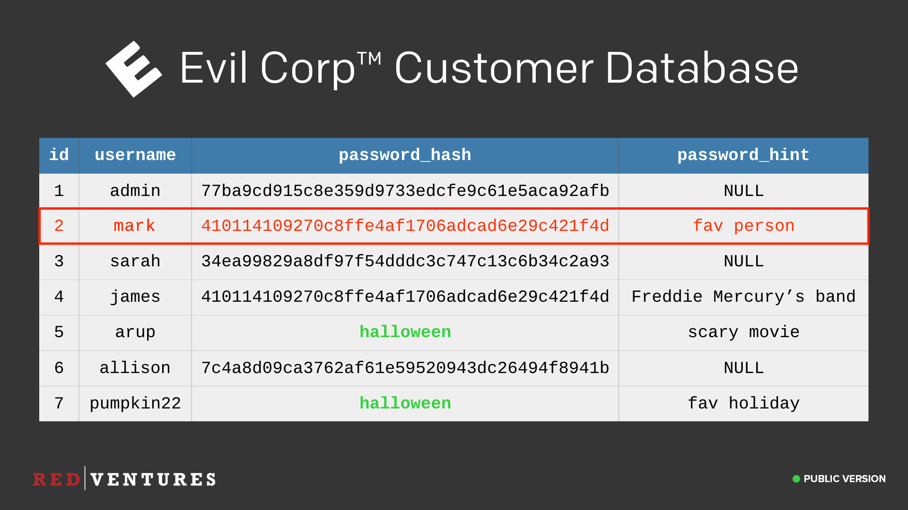</label>
_062. rich._

Let's look at the user "rich". Their password hint is "fav person". Well, that's not really much help to us. We don't know who "rich" is, and we have no idea who their favorite person is. In fact, that user probably thinks they're pretty safe, since only close friends would know the necessary information. There's no way a random attacker looking at the database could figure it out.

Unfortunately for them, another user has picked the same password.

---

### james

<input type="checkbox" id="063" /><label for="063"></label>
_063. james._

The user "james" has picked the same password, and has a much more obvious password hint. We can use this information to break the password for both users. Hopefully, you can figure out that the password in this case is `queen`.

---

### queen

<input type="checkbox" id="064" /><label for="064"></label>
_064. queen._

So even though "rich" thought they were safe, because of the way this website is storing user's password information, we could use the fact someone else has the same password in order to break theirs. Remember, just because you think you haven't provided much information, someone else may have. I've seen answers to security questions that include the user's password before.

Anyway, we've now broken 4 of these 7 users' passwords in less than a few minutes, and we've still yet to write any code or look like cool hackers from the movies.

---

### No more hints.

<input type="checkbox" id="065" /><label for="065"></label>
_065. No more hints._

But now we've got a problem. There are no more password hints to help us. These users have been a bit smarter and not provided any additional information. There are no other duplicate passwords to help us, we're on our own.

So how can we break these? I said at the start that the magic was irreversible, so there's no way to get the password if you only have the magic string. I did give one caveat though. If you already know a password goes to the magic string.

I think that a lot of people use numbers in their passwords. Dates, PIN codes, etc.

---

### Hashing All The Numbers

<input type="checkbox" id="066" /><label for="066"></label>
_066. Hashing all the numbers._

So let's just run the magic on every number from 1 to 1 million. This will give us a nice directory of magic string back to password if anyone is using dates.

You might think this takes a while, and if you were doing it on pen and paper you'd be right. However, we have computers, and they're pretty fast at this kind of stuff. It took my laptop less than a second to get the first million magic strings.

---

### Nerd Alert

<input type="checkbox" id="067" /><label for="067">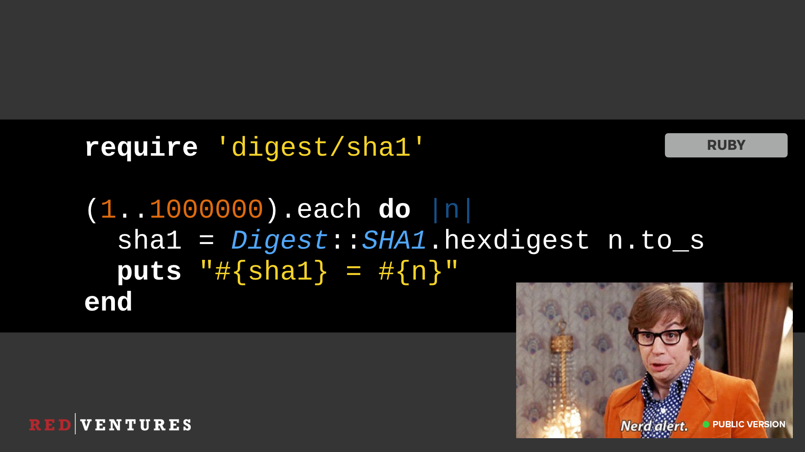</label>
_067. "Nerd alert"._

You may be thinking the code is complex and you need to be a master programmer to pull off this kind of feat. Alas, it's only a few lines of code in most modern languages.

---

### 1337

<input type="checkbox" id="068" /><label for="068"></label>
_068. 1337._

So in less than a second of computational power, we've now cracked an additional two passwords. Not bad, right?

---

### sarah

<input type="checkbox" id="069" /><label for="069"></label>
_069. sarah._

But now we've got another problem. There's still one user left (there's always one!). Now, we could keep going with our numbers game, all the way up to 1 trillion or further. But let's switch gears. I want to use the same technique, but not just for numbers. A lot of people use real words as their passwords, so perhaps we can try that.

---

### Hashing All The Words

<input type="checkbox" id="070" /><label for="070"></label>
_070. Hashing all the words._

Let's run our magic on every word in the English dictionary, and do the same thing as before. Again, you may be thinking this takes a while, but again, my laptop can do it in less than a second.

And, in less than a second...

---

### No luck

<input type="checkbox" id="071" /><label for="071"></label>
_071. No luck._

...oh, we didn't find anything. That's a bummer.

Well, we can keep using this same technique at least. We could try every possible combination of numbers and uppercase/lowercase letters up to say.. 9 characters long. I wonder how many possibilities there are?

---

### Trying everything takes too long

<input type="checkbox" id="072" /><label for="072">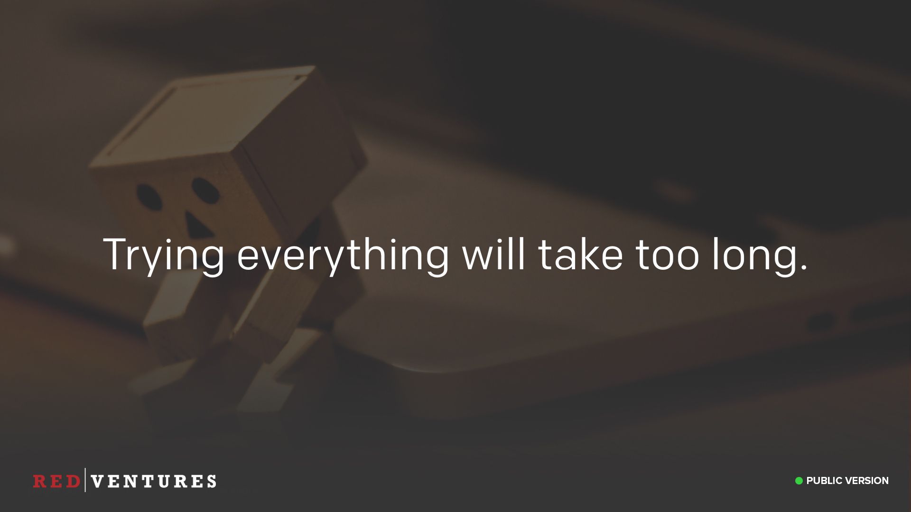</label>
_072. Trying everything will take too long._

It's around 13 quadrillion possible combinations. That's a lot. Far too many for my laptop to handle. In fact, it's far too many for most computers to handle in any reasonable amount of time.

Luckily for us, someone has already done the hard work.

---

### Magic Lists

<input type="checkbox" id="073" /><label for="073"></label>
_073. Magic Lists. [Reference](http://project-rainbowcrack.com/table.htm)_

There are things called "Rainbow Tables", in our parlance, "Magic Lists". There are massive files that have the full collection of magic strings for all sorts of situations. The one we're interested in is the 4th down from the top, every mixed-case alphanumeric up to 9 characters long. It's a 690GB file, which isn't too bad. We can just download that to an Amazon Web Services instance, and pay by the hour to try and crack our remaining password.

And in less than an hour...

---

### Cracked

<input type="checkbox" id="074" /><label for="074">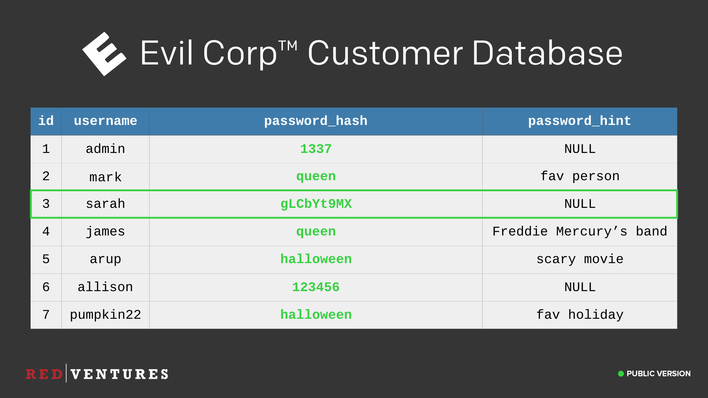</label>
_074. Cracked._

...we'll have broken our final password.

Pretty cool, right? Everyone feel like a movie hacker now?

Some of you may be looking at that password and getting pretty scared. I mean, it's a pretty good password to be fair.

---

### gLCbYt9MX

<input type="checkbox" id="075" /><label for="075">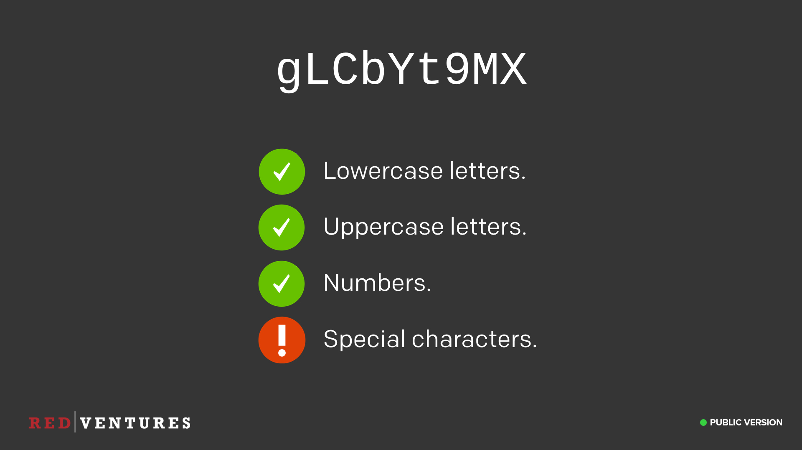</label>
_075. gLCbYt9MX._

There's mixture of cases, it's 9 characters long, there are numbers in it, it's not a real word. The only thing really missing are special characters. I would wager that a lot of you might use worse passwords than this for a lot of things, and thought your passwords were safe. How do you feel about that now?

I'm not showing you all this to scare you. Well, I guess I am a bit. But I should apologize, because I've actually let you all astray ever so slightly. The type of attack I just showed, using "Magic Lists", is not too hard to defend against.

---

### Salting

<input type="checkbox" id="076" /><label for="076"></label>
_076. Salting._

There's a technique called "salting" which can stop this type of attack from working. You don't need to know what it is, just that it works, and it's been around since at least the 1970s, probably earlier. (Another one of my favorite stock images by the way).

So great, this technique has existed forever, and stops this attack. So, we're safe? No one would ever not use this "salting" stuff on their modern website.

---

### Password Leaks

<input type="checkbox" id="077" /><label for="077"></label>
_077. Password leaks. [Reference](http://www.informationisbeautiful.net/visualizations/worlds-biggest-data-breaches-hacks/)_

Unfortunately not. Lots of companies are using unsalted hashes to store their passwords. Does everyone remember the LinkedIn breach from 2012? I'm sure you all still get SPAM from it. Well, they were storing passwords _exactly_ how I just showed in the EvilCorp example. If your password was "halloween", then what you saw was exactly how they were storing it in their database.

These others here used something called "MD5", that's just the name of the "Magic" being used. MD5 is older and weaker than SHA-1, which is what I showed in my example.

Hell, even Yahoo used MD5, they had it in their FAQ for the recent breach. They didn't specify if it was salted or not, which means it probably wasn't.

---

### What happens when passwords are leaked?

<input type="checkbox" id="078" /><label for="078">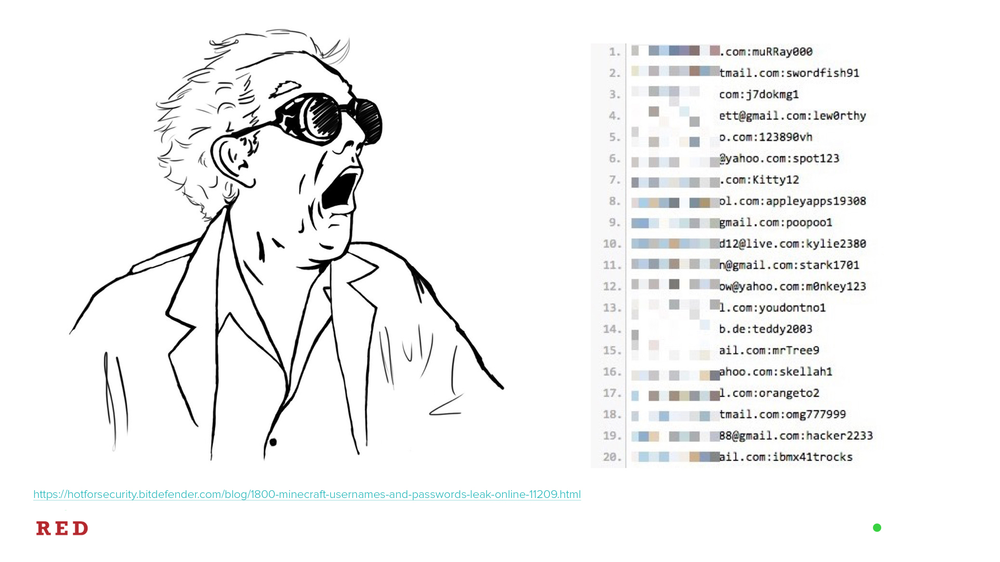</label>
_078. What happens when passwords are leaked? [Reference](https://hotforsecurity.bitdefender.com/blog/1800-minecraft-usernames-and-passwords-leak-online-11209.html)._

So what happens when these passwords leaks take place? Generally, once an attacker has stolen a database, they'll run it against those "Magic Lists" to produce a list of email and password combinations. They might not be able to break all the passwords, but they'll get a good chunk of them.

Most people reuse their email and password combinations for other things. So the attacker will start logging into all the other accounts they can, whether it's to steal information, or money. This can all be done _very_ quickly after a database is stolen.

It's usually months before the breach is known, by which point it's already too late. Chances are that your account passwords have been stolen. You can check using this website maintained by security guru Troy Hunt: [haveibeenpwned.com](https://haveibeenpwned.com/).

The point I'm trying to make is that you can't control another website's security. You have absolutely no control over how another website stores your password or protects their database. So you need to protect yourself instead.

---

### Best Practices

<input type="checkbox" id="079" /><label for="079">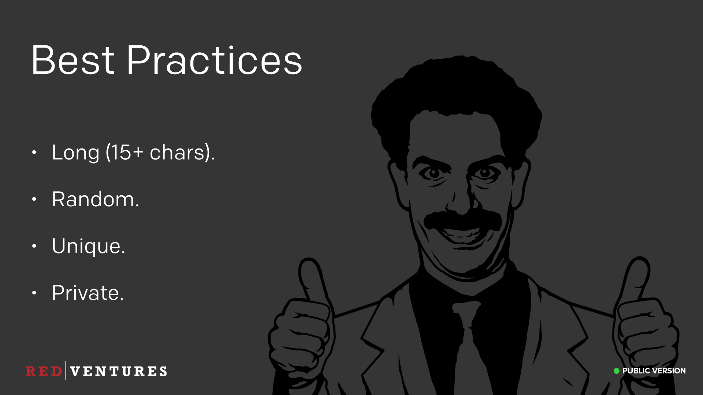</label>
_079. Best practices._

By following best practices with your passwords, you can massively reduce the chance that you'll succumb to an attack on another website, regardless of how they store your information.

If you use a different password everywhere, then only the password for that service is broken. Since the attacker will likely already have all information stored with that service, they're not going to get any additional information they didn't already have.

So, your passwords should all be long, random, unique, and private. Now, a lot of you will likely be thinking the same thing right now, and I assure you that I'll get to the elephant in the room soon. But first, I want to talk about each of these criteria, and why they're important.

---

### Long

<input type="checkbox" id="080" /><label for="080">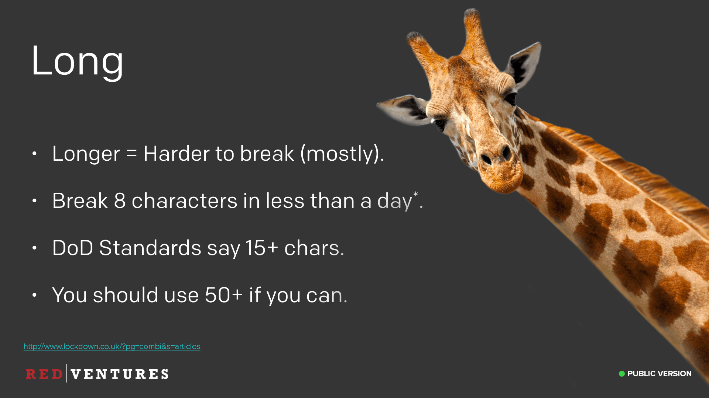</label>
_080. Long. [Reference](http://www.lockdown.co.uk/?pg=combi&s=articles)_

First, your passwords should be long. Hopefully it's mostly intuitive that the longer a password is, the harder it will be to break. At least in general. If your password is 20 of the same character, then that changes things a little.

It's worth noting that it's now possible to break 8 character passwords in less than a day with current computation power, regardless of how it's stored. Now, you're average attacker won't have access to this kind of power, we're talking more about nation state actors here.

Current Department of Defense standards recommend 15 or more characters for your password. I recommend 50 or more. I see some wide eyes in the audience, don't worry, I know what you're thinking, and I'll get to it shortly.

---

### Random

<input type="checkbox" id="081" /><label for="081">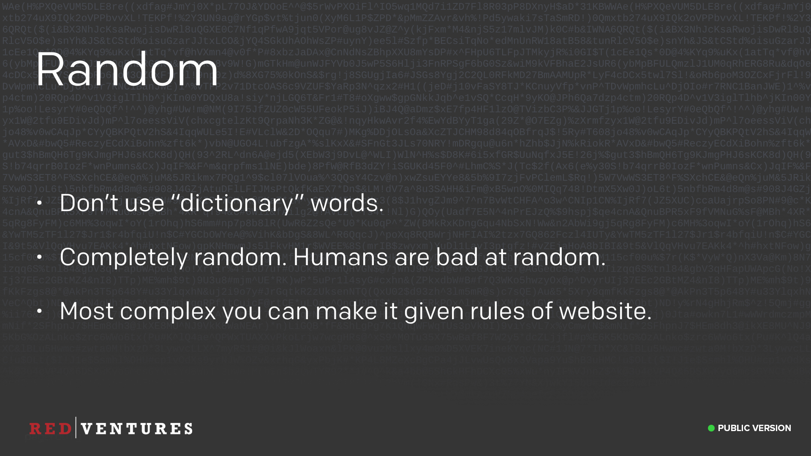</label>
_081. Random._

Next, your passwords also need to be random. I've said here not to use dictionary words, but "dictionary" is in quotes. I don't just mean the English dictionary. There are things called password dictionaries, too. Remember a few slides ago, I showed you some email and password combinations that had been broken. When big websites get breached, the broken passwords get added to a password list and sorted by popularity. These can then be used to brute force (i.e. try every possibility until it works) other people's accounts.

So while words like `letmein` aren't in the English dictionary, they will be near the top of any password dictionary. It's just as important not to use these kinds of words.

You need to make them completely random, and humans are very bad at random. Even mashing your keyboard you're probably alternating your right and left hands, meaning there's patterns that can be implied. Computers are the things that are going to be breaking your passwords, so a computer should be the one generating it, too.

Unfortunately, not all websites let you make completely random passwords. Some of them won't let you use certain characters, because of the way their systems work (this is usually an indication they're not storing passwords properly). You need to work within these restrictions, but use as many of the other available characters as you can in your passwords.

---

### Unique

<input type="checkbox" id="082" /><label for="082"></label>
_082. Unique._

Your passwords should be completely unique. Every single account you have should get it's own password, and you shouldn't follow patterns. I see advice sometimes where you just pick one password, then append the name of the website to it, that way you get a different password everywhere. This is bad advice, please don't follow it. First, if I break one of your passwords, it's trivial to figure out your pattern, and second if you ever need to rotate your password on one site, you're going to have a bad time.

You can't assume anything about how a website stores your password. For all you know they could be storing the password directly (we call this "in the clear", or "in plaintext"). So you need to use a completely unique password for every single login. Anywhere you use the same password becomes vulnerable as soon as one of those sites gets breached. And remember, you may not know about a breach until years later.

---

### Private

<input type="checkbox" id="083" /><label for="083"></label>
_083. Private._

Finally, your passwords are private. Never ever share them with anyone. Not your loved ones, not your barber, not your Lyft driver. If you do things properly, even you probably won't know your own passwords (I'll get to how in a moment).

Also, you should never send your passwords over insecure channels. Don't email passwords to people, don't send them over IM, or Slack. If we need to share an initial password for you to login to a tool for the first time, we share it using a dedicated tool specifically designed for password management. If you ever accidentally post your password to somewhere that's not secure, you should consider it compromised and change it as soon as possible.

And finally, we will _never_ ask you for your password, under any circumstances. It should be a giant red flag if anyone at Red Ventures ever asks for your password. Never give it out.

---

### Treat passwords like toothbrush.

<input type="checkbox" id="084" /><label for="084"></label>
_084. "Treat your password like your toothbrush. Don't let anybody else use it, and get a new one every six months."_

Here's a quote from Clifford Stoll on passwords which I thought was funny. Although I advise you replace your toothbrush a bit more often than six months.

Ok, so now we know what passwords should look like, let's look at a few examples of bad and good passwords.

---

### Bad Passwords

<input type="checkbox" id="085" /><label for="085">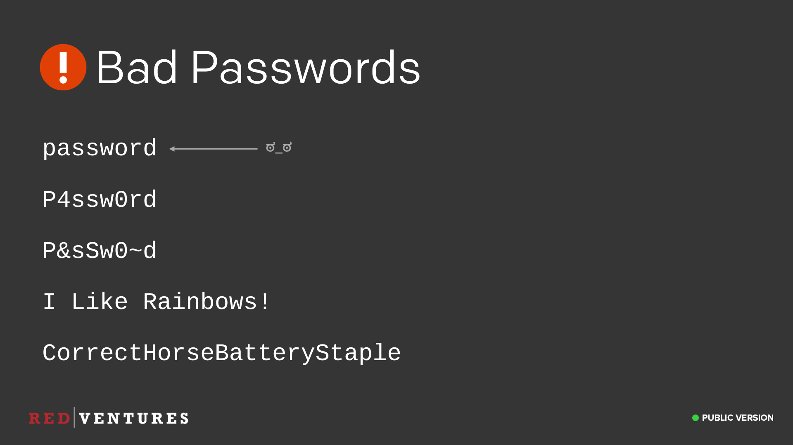</label>
_085. Bad passwords._

Hopefully it's all clear to you why `password` is a really bad password to use. Please don't ever use it, or any dictionary word. What about the next one though, `P4ssw0rd`? The "a" has been replaced with a "4" and the "o" a "0". This can also be trivially broken, as these are standard letter replacements and are a widely known technique. This might add a few minutes to the amount of time it takes to break.

The next one is better, `P&sSw0~d`, we've got special characters in there now, and not some standard replacements. But the password is only 8 characters long, and as we learned earlier, that's too short.

What about `I Like Rainbows!`. This is going to be much harder to break, but there are password cracking tools specifically designed for sentence based passwords. You can treat each word here like an individual "token", and it becomes similar to a 4 character password (albeit with a _much_ larger alphabet). This will certainly take longer than the others to break, but it can be broken much quicker than you probably realize.

And finally, `CorrectHorseBatterStaple`. This was featured in an [XKCD webcomic](https://xkcd.com/936/) a while back as a method for choosing good passwords. Unfortunately, it's not a great password. Mainly because it's already been featured in the comic and is public information. But this is another known technique, and there are tools that can break passwords which are composed of normal words like this. It will take much longer to break, don't get me wrong, but there are much better passwords you can use.

OK, so what are some good passwords then?

---

### Good Passwords

<input type="checkbox" id="086" /><label for="086">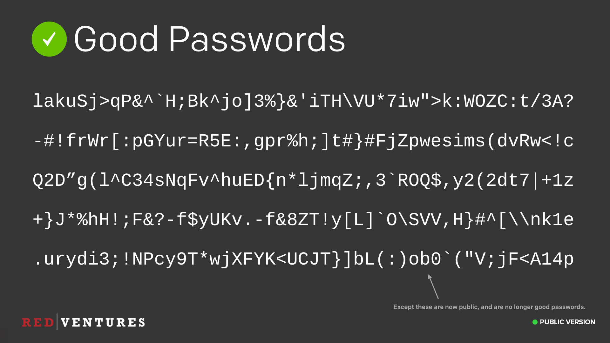</label>
_086. Good passwords._

These are good passwords. They're long, unique, and random. Although obviously they're no longer private because they're on this slide and you've all seen them, but this gives you an idea of what your passwords should be looking like.

Anyone want to take a shot at memorizing these?

Yeah, that's going to be tricky.

---

### Elephant in the Room

<input type="checkbox" id="087" /><label for="087"></label>
_087. Let's talk about the elephant in the room._

Which brings me to the elephant in the room. The thing a lot of you have been thinking for the last few minutes.

---

### I can't remember that

<input type="checkbox" id="088" /><label for="088"></label>
_088. "I can't remember that."_

There's not a chance in hell we can remember those types of passwords.

That's the point. Any password that's easy for a human to remember is going to be even easier for a computer to break. Like I said before, computers are going to be breaking your passwords, so they have to be suitably complex in order to stand up.

So how do you remember all the passwords? You don't.

---

### Use a Password Manager

<input type="checkbox" id="089" /><label for="089"></label>
_089. Use a password manager. [Reference](https://1password.com/)_

You need to use a tool called a "Password Manager". There are lots out there, and you've probably heard of a lot of them. "[LastPass](https://www.lastpass.com/)", "[1Password](https://1password.com/)", "[KeePass](https://keepass.info/)", etc. They each have their own pros and cons depending on how you prefer to operate. Most have browser plugins to automatically enter your passwords for you (although there have been some security issues there in the past). But they're all designed to do pretty much one thing. Store a lookup of all your usernames and passwords, protected by a single "master password", which is the one password (hey, that's the name of one of the tools) you need to remember. The idea is that it'll be the last password (hey, that's the name of another one!) you need to remember.

We use LastPass here at Red Ventures, so if you can't decide on a tool, then you may as well go with that one. One quick thing to note, make sure to use a different tool or vault for your personal vs work passwords. We revoke access to the Red Ventures ones when you leave, so you don't want all your personal ones to disappear too!

If there's only one thing you take away from today's training, please make it this: Using a password manager is the single most effective thing you can do to enhance your security online. Actually, maybe two-factor authentication too, we'll get to that later though.

Let's talk a bit more about password managers.

---

### Password Managers

<input type="checkbox" id="090" /><label for="090"></label>
_090. Password managers._

Password managers are designed to remember all of your passwords for you, in a secure way. They can also generate completely random passwords for you, and you can typically change the criteria associated with this generation. So if a website doesn't let you use special symbols, you can exclude those and still get a strong password.

> Mark's "Fun" Tidbit: One of the (many) password restrictions on The US Citizenship and Immigration Service website is "Your Password cannot contain the dollar ($) sign". I always thought that seemed a little ironic.

But the most important feature of password managers is that they let you use a completely different password for everything, without having to worry about remembering it yourself.

---

### Password Managers (2)

<input type="checkbox" id="091" /><label for="091">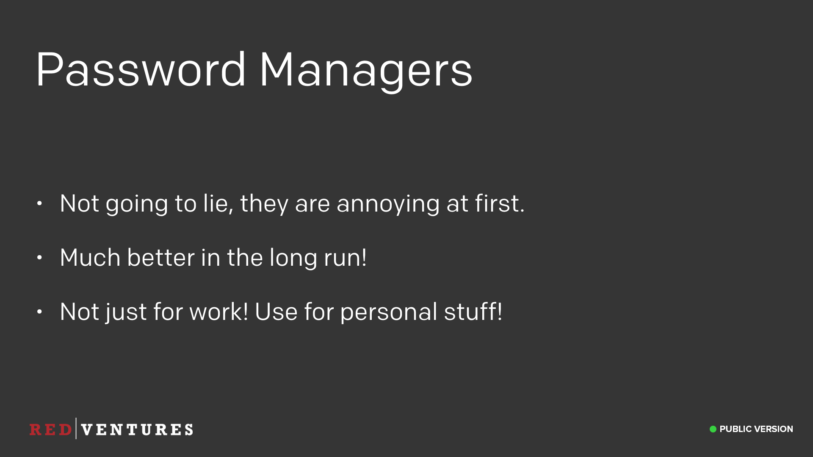</label>
_091. Password managers._

Now, I'm not going to lie to you. Switching from using the same password everywhere, to using a password manager, is reaaally annoying. It's going to slow you down when you want to access websites, and you're going to have to go to every place you have an account and change your password. It really is going to be a pain.

But it gets much easier as you get used to it, and it is so much better in the long run.

I should be clear too, I'm not just advocating for you to use them for all Red Ventures related passwords, you should use one for all your personal accounts too. Amazon, your bank, etc.

---

### Eggs In One Basket

<input type="checkbox" id="092" /><label for="092"></label>
_092. Eggs in a basket._

Some of you may be thinking "aren't we just putting all our eggs in one basket though? What happens if the password manager gets broken into!"

---

### Troy Hunt Quote

<input type="checkbox" id="093" /><label for="093"></label>
_093. Password managers don't have to be perfect. [Reference](https://www.troyhunt.com/password-managers-dont-have-to-be-perfect-they-just-have-to-be-better-than-not-having-one/)_

And you're right, that is a concern. But we're playing the odds. It is much more likely that you will get compromised if you use the same password everywhere, than it is that an attacker can physically take your password manager _AND_ break your master password. This is why it's important to chose a strong master password.

This quote from Troy Hunt explains it well. Password managers don't have to be perfect, they just have to be better than not having one.

---

### Pick a Good Master Password

<input type="checkbox" id="094" /><label for="094">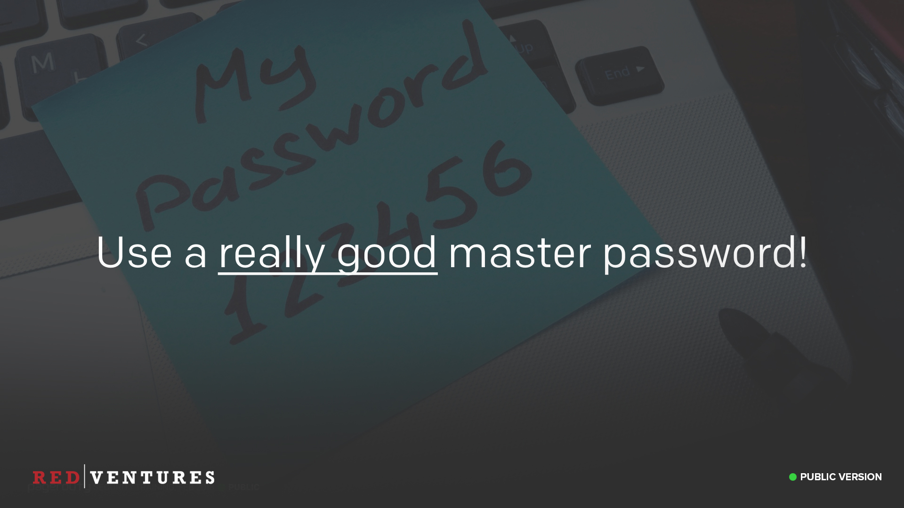</label>
_094. Pick a good master password._

But your password manager is only as good as the master password you pick. So you need to pick a good one, and you need to memorize it. Unfortunately this is one password you can’t store in your password manager.

---

### Memory Tips

<input type="checkbox" id="095" /><label for="095">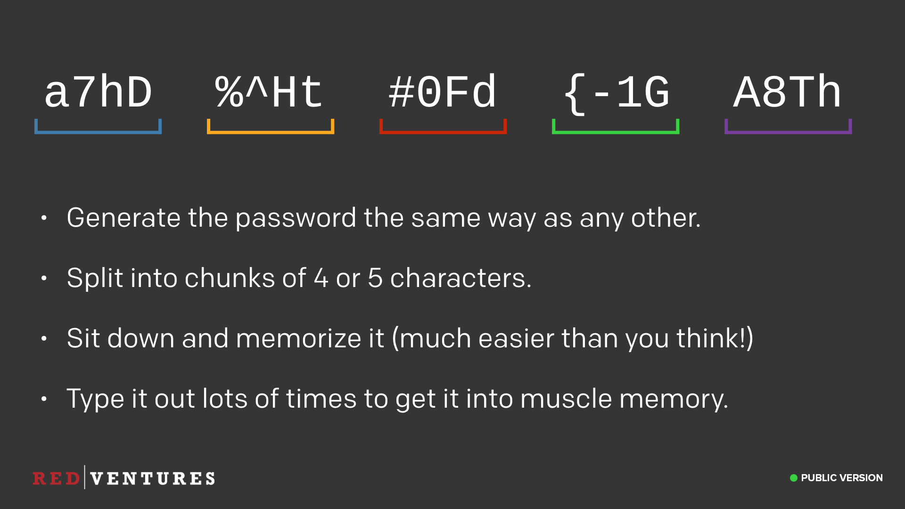</label>
_095. Memory tips._

I have some tips for memorizing a complex password that you may find useful.

First of all though, make sure you generate a password based on the guidelines we’ve already talked about. It's no good having awesome passwords stored in your password manager if the master password is `letmein`.

To have an easier time of memorizing it, try splitting it into chunks of 4 or 5 characters, like you see here. Then remember those chunks. Literally, just sit down and memorize them. You'll be amazed at how quickly you can retain the information. After about 5 minutes, stop and come back to it later, and see how much you can still remember. It'll take a few tries, but it will soon start to stick.

Another tip is to type out the password lots of times in a text editor, in order to get it into your muscle memory. You'll mess it up a few times at first, but quicker than you think, you'll be typing out a 30 character complex password entirely from memory.

---

### But Wait, There's More!

<input type="checkbox" id="096" /><label for="096">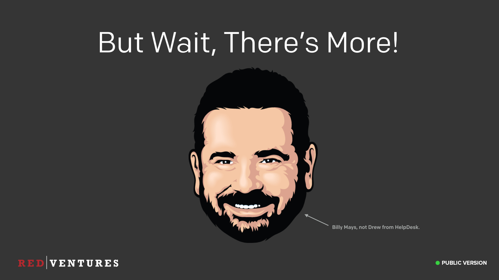</label>
_096. But Wait, There's More!._

But wait, there's more! Just because we now have a good process for passwords, doesn't mean than we're done.

---

### Password Equivalency

<input type="checkbox" id="097" /><label for="097">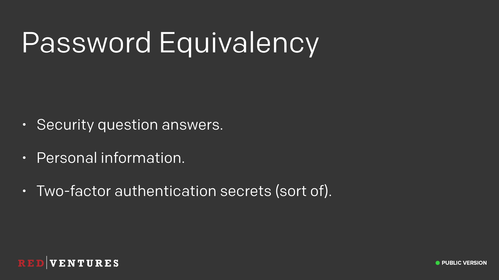</label>
_097. Password equivalency._

There's some things that are basically the same as your password. For example, security question answers. If I have that information, I can likely gain access to your account as if I had your password.

Personal information too, since a lot of website will allow you to reset your account based on that information. Does that shopping website really need to know your date of birth? Probably not. Use a fake one and put it into your password manager.

Two-factor secrets are different, they're not equivalent to a password, but I've listed them here since they should be treated as such.

---

### Security Questions

<input type="checkbox" id="098" /><label for="098">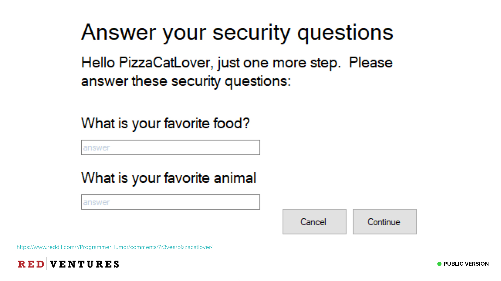</label>
_098. Security Questions. [Reference](https://www.reddit.com/r/ProgrammerHumor/comments/7r3vea/pizzacatlover/)_

I'll be honest, I absolutely hate security questions. They solve a customer support problem, not a security problem. In fact, from a security perspective all they do is weaken it. If you ever have the option not to set security questions at all, take it.

---

### Security Questions

<input type="checkbox" id="099" /><label for="099">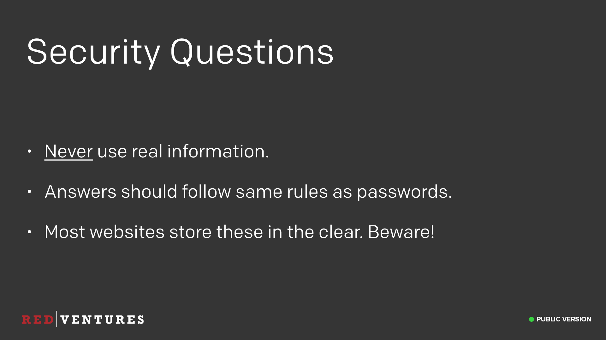</label>
_099. Security Questions._

Unfortunately most websites force you to set security questions and answers, giving you no choice but to enter something.

In which case, you should never, ever, under any circumstances use real information. There's always someone out there who's going to know that information. No matter how strong you make your password, if you use real information for your security questions, your account is going to be easier to compromise. Treat them like passwords, generate them in your password manager and store them there.

Most websites store this information in the clear, despite them being password equivalent, they are not treated as such. Most customer support agents will be able to see them on the screen in front of them.

There's even a slight risk that using randomly generating strings will get you into trouble, as I've been able to convince a support agent in the past that their system must have corrupted the field, which they concurred with since all they saw was random characters. You can't win, so again, we just need to play the odds. It's much more likely that using weak security question answers will get your data stolen.

---

### United Airlines "Security"

<input type="checkbox" id="100" /><label for="100"></label>
_100. United Airlines "Security"._

Some companies go even further with their security questions. Here's United Airlines recent "improvements" to their security. Not only do they force you to pick 5 security questions, but your answers must be chosen from a dropdown of choices they provide.

Now when you need to reset your password, you are given two of these questions, and the answer drop down for each has 10 possible choices. So that's only 100 possible combinations to guess. The irony here is that they implemented this to replace PIN codes, which were 1,000 possible attempts, for not being secure enough.

But again, they give you no choice here. You can't generate your own answers, and you can't opt-out. Sometimes you just have to play their game and move on.

One thing that stood out about these changes are that United called these security questions "Two-Factor Authentication". But that's not entirely accurate.

---

### Multi-Factor Authentication

<input type="checkbox" id="101" /><label for="101"></label>
_101. Knowledge, possession, inherence. [Reference](https://en.wikipedia.org/wiki/Multi-factor_authentication)_

You have have heard the term "multi-factor authentication", or "two-factor authentication" a lot. But what exactly is it?

In the field of authentication, there are three main types of evidence (or "factors") you can provide. These are called "Knowledge", "Possession", and "Inherence".

---

### Multi-Factor In Plain English

<input type="checkbox" id="102" /><label for="102">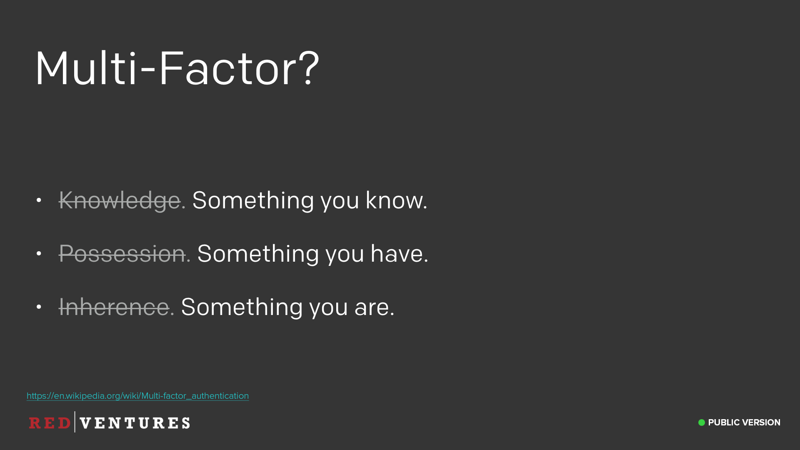</label>
_102. Multi-Factor. [Reference](https://en.wikipedia.org/wiki/Multi-factor_authentication)_

In plain English, that's Something you know, Something you have, and Something you are.

---

### Password, Device, Fingerprint

<input type="checkbox" id="103" /><label for="103">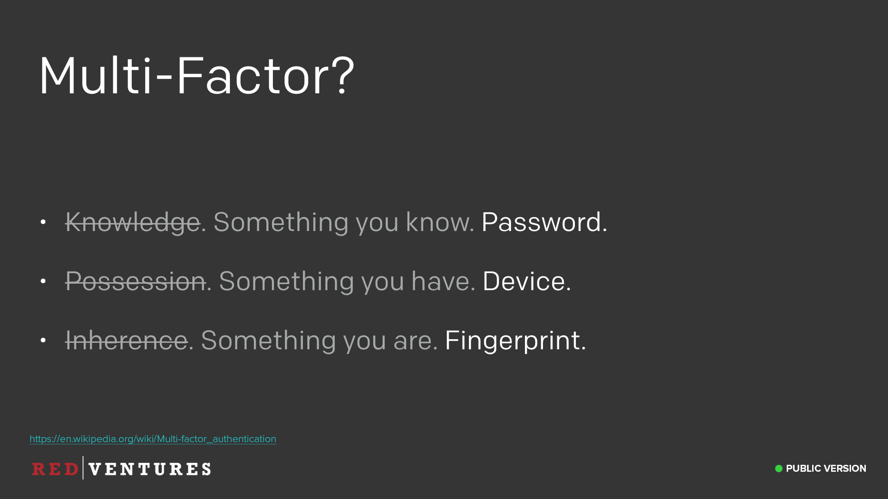</label>
_103. Password, Device, Fingerprint. [Reference](https://en.wikipedia.org/wiki/Multi-factor_authentication)_

So, something you know would be a password. Something you have would be your phone, or a physical object. And something you are would be a fingerprint, or some other form of biometrics.

---

### Two-Factor

<input type="checkbox" id="104" /><label for="104">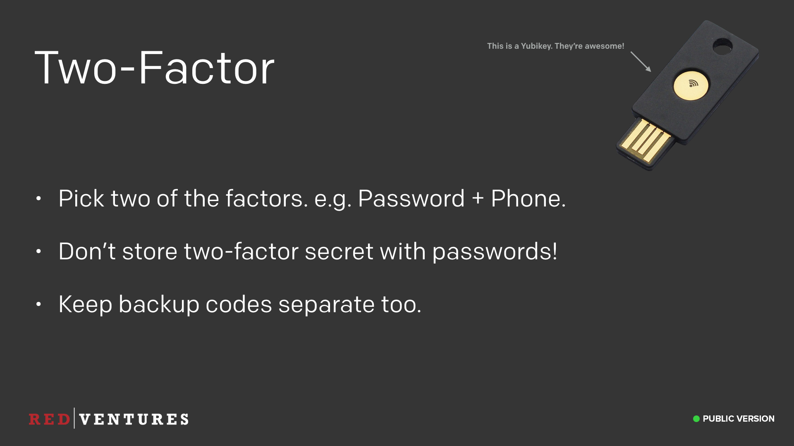</label>
_104. Two-Factor._

The idea of two-factor authentication is that you pick two of these factors, and require them in order to authenticate a user. While an attacker might be able to remotely steal your password, it's pretty unlikely they'd also be able to physically steal your phone or get a fingerprint. Likewise, if an attacker can physically steal your phone, it's unlikely they'd also be able to get your password.

As you can probably now understand, the United Airlines authentication I showed earlier is not two-factor authentication, as security question answers are the same as your password, they're both "Something you know".

In order for two-factor authentication to be most effective, it's important not to store the two-factor codes with your passwords. This goes back to that security vs convenience trade-off I talked about at the start. It's very convenient to have them in the same place, but then if an attacker gets one, it means they get the other too.

Some password managers let you store the two-factor secrets with the passwords. You do still gain some security advantages there. But it's much better to keep your two-factor codes in a separate password manager. Then if your original master password is broken, an attacker only gets one.

This all applies to backup codes too. Typically you should just print those off and put them somewhere safe. They're your absolute failsafe.

---

### Use Two-Factor Authentication

<input type="checkbox" id="106" /><label for="106"></label>
_106. Use two-factor authentication._

The big takeaway from all this, is to make sure you use two-factor authentication wherever it's available. Some Red Ventures systems enforce two-factor authentication, so you may already be used to it here. But you should use it for all your personal stuff too. GMail, Facebook, Dropbox, GitHub, Amazon, etc. They all have two-factor authentication options available.

---

